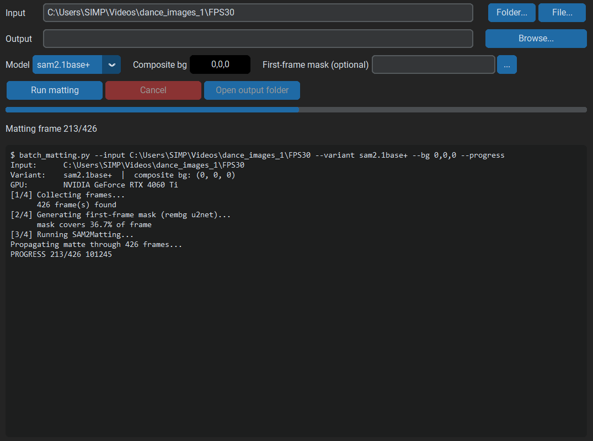

#  SAM2Matting GUI

This project is a fork of the original [SAM2Matting by FudanCVL](https://github.com/FudanCVL/SAM2Matting) (Ruiqi Shen, Guangquan Jie, Chang Liu, Henghui Ding — Fudan University). Huge thanks to the authors for creating this excellent matting framework! Check out their [project page](https://henghuiding.com/SAM2Matting/), the [paper on arXiv](https://arxiv.org/abs/2606.27339), and the [model checkpoints on Hugging Face](https://huggingface.co/FudanCVL/SAM2Matting).

This version focuses on providing a user-friendly **Graphical User Interface (GUI)** and a **batch pipeline** for Windows users — point it at a folder of frames, a video, or a single image and get clean alpha mattes with no command line and no manual mask drawing.

The original documentation is preserved in [SAM2Matting-README.md](SAM2Matting-README.md).

### Screenshot

*Pick an input, choose a model, and follow the run live with a progress bar and full log.*



## ✨ Features

This fork includes the full original model code, plus:

*   **Graphical User Interface (GUI):** Simple dark-mode interface (customtkinter) — no command line needed.
*   **Batch Processing:** Process a whole directory of frames, a video file (`.mp4`, `.mov`, `.avi`, `.mkv`, `.webm`), or a single image in one go.
*   **Automatic Prompting:** The first-frame mask prompt is generated automatically (rembg / u2net) — no clicking points or drawing masks. You can still supply your own mask PNG to override it.
*   **Temporally Consistent Video Mattes:** Multi-frame inputs use the video predictor, propagating one mask through the whole clip (no per-frame flicker).
*   **Three Outputs per Frame:** `alpha/` (grayscale matte), `composite/` (foreground over a solid color of your choice), and `transparent/` (RGBA PNG), all keeping the original frame names.
*   **All Three Model Variants:** Switch between SAM2.1 Tiny, SAM2.1 Base+, and SAM3 from a dropdown — missing checkpoints are downloaded automatically from Hugging Face.
*   **Live Progress:** Progress bar, frame counter, and a scrolling log; cancel a run at any time.
*   **Timestamped Output Folders:** Each run saves to `<input>_<timestamp>_matting`, so re-runs never overwrite earlier results.
*   **Self-Healing Launcher:** `run_matting.bat` rebuilds the venv, reinstalls dependencies, and re-downloads checkpoints if anything is missing.
*   **Fully Local:** After first-time setup nothing is uploaded anywhere — your frames never leave your machine.

### Core Features (from the original)

- Generalized image & video matting of open-world targets.
- High-quality alpha mattes with fine hair/edge detail.
- Decoupled high-level tracking and dedicated low-level matting.
- SAM2.1 and SAM3 based variants with mask, point, box, and text prompts.

## 💻 How to Use (Easy Way)

Requirements: Windows 10/11 and an NVIDIA GPU (CUDA). No Python installation needed.

1.  Go to the [**Releases**](https://github.com/ZeroHackz/GUI-SAM2Matting/releases) page.
2.  Download the latest `SAM2MattingPortableGUI.exe` and put it in an empty folder (it sets up next to itself).
3.  Run it. On **first run** it downloads its own Python and dependencies (~3.5 GB, one time) right next to the exe — watch the log. Model checkpoints are **not** bundled either; the selected model (default ~380 MB) downloads automatically on your first matting run.
4.  Click **Folder...** (frame directory) or **File...** (video or image) to pick your input.
5.  Optionally pick a model variant, composite background color, or output folder.
6.  Click **Run matting** and watch the log. When it finishes, **Open output folder** takes you straight to the results.

Everything stays inside the exe's folder — delete the folder and the app is gone.

## 🛠️ From Source (Developers)

Requirements: Windows, an NVIDIA GPU (CUDA), [Python 3.10](https://www.python.org/downloads/), and [PowerShell 7](https://github.com/PowerShell/PowerShell).

1.  Clone this repository:
    ```bash
    git clone https://github.com/ZeroHackz/GUI-SAM2Matting.git
    ```
2.  Double-click **`run_matting.bat`**. The first run builds the environment (the PyTorch download is ~3 GB) and fetches the default checkpoint, then the GUI opens.
3.  To build the portable executable yourself, run **`build.bat`** — the exe lands in the `dist` folder.

## CLI Usage

The same pipeline is available from the command line:

```bat
run_matting.bat <frames-dir | video | image> [--output DIR] [--bg R,G,B] [--mask PNG] [--variant sam2.1tiny|sam2.1base+|sam3]
```

Examples:

```bat
run_matting.bat C:\clips\dance_frames
run_matting.bat C:\clips\dance.mp4 --bg 0,255,0 --variant sam2.1tiny
```

The original inference scripts (`inference_image_sam2.py`, `inference_video_sam2.py`, etc.) are untouched and still work as documented in the [original README](SAM2Matting-README.md).

## 📄 License & Credits

All model code, architectures, and checkpoints are the work of the original authors — see [LICENSE](LICENSE) and please cite their paper:

```bibtex
@inproceedings{SAM2Matting,
  title={{SAM2Matting}: Generalized Image and Video Matting},
  author={Shen, Ruiqi and Jie, Guangquan and Liu, Chang and Ding, Henghui},
  booktitle={European Conference on Computer Vision (ECCV)},
  year={2026}
}
```

SAM2Matting is licensed under **CC BY-NC-SA 4.0 for non-commercial research use only** — this fork inherits that license. It only adds the GUI, batch pipeline, and Windows launcher tooling on top.
